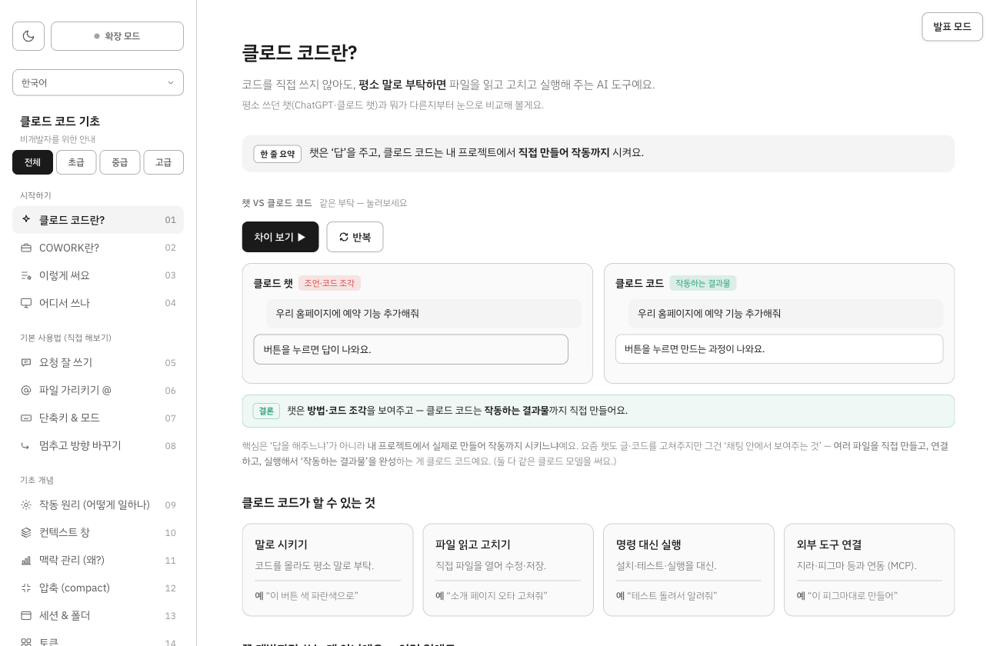
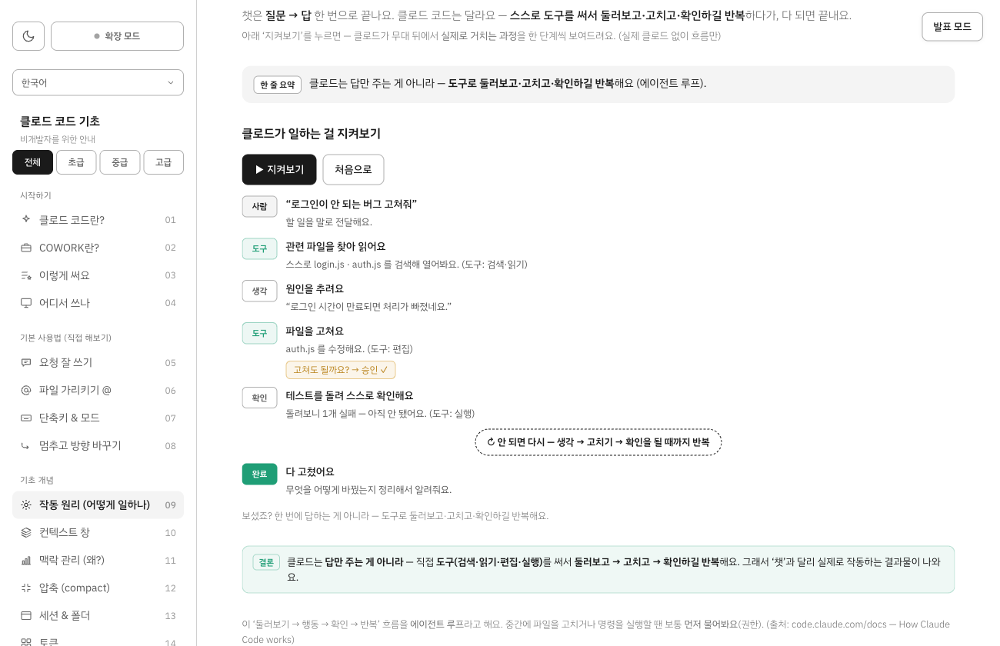
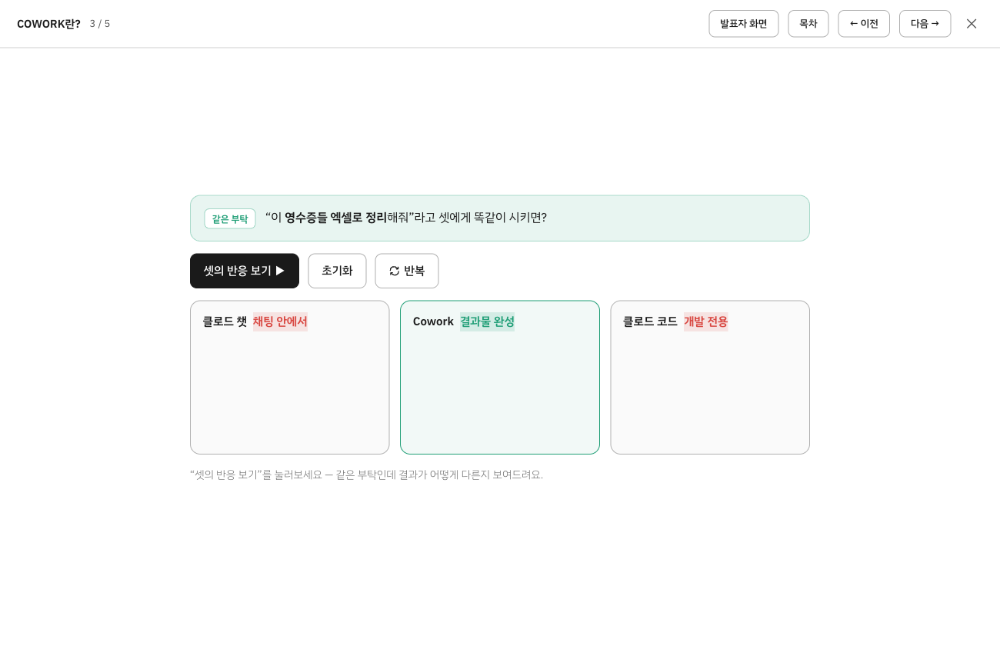
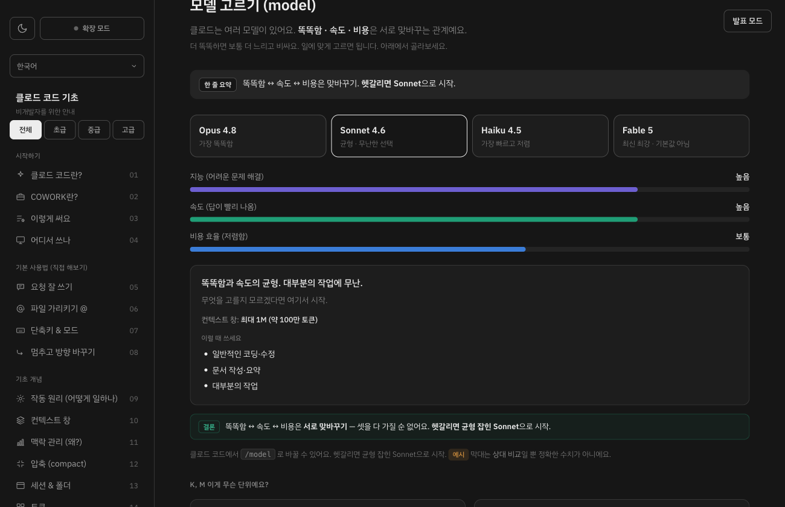

# 클로드 코드 기초 — 비개발자를 위한 인터랙티브 가이드 (비공식)

코드를 한 줄도 몰라도 **Claude Code의 핵심 개념**을 **직접 눌러보고·입력해보고·따라 해보며** 익히는 한 페이지 학습 가이드입니다. 모든 개념에 **클릭하면 움직이는 시뮬레이션**이 붙어 있어, 설명을 읽기만 하는 게 아니라 *체험*하면서 이해합니다. 초등학생도 따라올 수 있는 눈높이를 목표로 만들었습니다.

> ⚠️ 이 자료는 **비공식 학습 자료**이며 Anthropic과 무관합니다. (맨 아래 “고지” 참고)



## 🔗 바로 보기 (Live)

| 언어 | 주소 |
|---|---|
| 🇰🇷 한국어 | **[wlsdks.github.io/claude-code-guide](https://wlsdks.github.io/claude-code-guide/)** |
| 🇺🇸 English | **[/en/](https://wlsdks.github.io/claude-code-guide/en/)** |
| 🇨🇳 中文 (简体) | **[/zh/](https://wlsdks.github.io/claude-code-guide/zh/)** |
| 🇯🇵 日本語 | **[/ja/](https://wlsdks.github.io/claude-code-guide/ja/)** |

좌측 상단 드롭다운에서 언제든 언어를 바꿀 수 있어요.

## ✨ 무엇이 다른가요

- **시뮬레이션 우선** — 37개 주제마다 “▶ 눌러보세요” 버튼이 있어, 개념이 *애니메이션으로* 펼쳐집니다. 클로드 코드를 설치하지 않아도 동작 원리를 눈으로 봅니다.
- **직접 해보는 실습형** — 요청을 *직접 타이핑하면 점수를 매겨주고*, `@`로 파일을 골라 붙여보고, 단축키를 눌러 효과를 확인하는 등 **손으로 익힙니다.**
- **난이도 모드** — `초급 / 중급 / 고급` 칩으로 내 수준에 맞는 주제만 골라 봅니다. (초급만 20개)
- **발표 모드 (PPT처럼)** — 어느 페이지든 우측 상단 `발표 모드`를 누르면 **한 화면씩 슬라이드**로 크게 보여줍니다. 강의·세미나용.
- **발표자 보기 (멀티모니터)** — `발표자 화면`을 누르면 **청중용 창**이 따로 열려 두 번째 모니터로 미러링됩니다. 발표자 화면엔 **타이머·다음 슬라이드 미리보기**가 함께 표시됩니다.
- **현실 비유** — 어려운 개념을 *책상·도마·영수증·레시피 카드·조별과제* 같은 일상 비유로 풀어 줍니다.
- **라이트/다크 + 완전 반응형** — 휴대폰·태블릿·노트북·대형 화면(24·27인치) 모두 최적화.
- **용어 사전 + 점선 툴팁** — 모르는 단어는 그 자리에서 뜻을 확인하고, 검색되는 용어 사전도 제공합니다.

## 📸 화면

| 작동 원리 시뮬레이션 | 발표 모드 |
|---|---|
|  |  |
| 클로드가 *도구를 써서 둘러보고·고치고·확인하길 반복*하는 과정을 단계별로. | 한 화면씩 크게 — 강의·발표용. (`발표자 화면`은 멀티모니터 미러링) |

| 다크 모드 |
|---|
|  |

## 📚 다루는 내용 (37개 주제 · 8개 묶음)

- **시작하기** — 클로드 코드란?(챗 vs 코드 비교) · COWORK란? · 이렇게 써요(직업별) · 어디서 쓰나
- **기본 사용법 (직접 해보기)** — 요청 잘 쓰기(채점) · 파일 가리키기 `@` · 단축키 & 모드 · 멈추고 방향 바꾸기
- **기초 개념** — 작동 원리(에이전트 루프) · 컨텍스트 창 · 맥락 관리 · 압축(compact) · 세션 & 폴더 · 토큰 · 모델 고르기 · 생각의 깊이(effort)
- **기억과 규칙** — CLAUDE.md · 메모리 · 스킬
- **능력 확장** — MCP(도구 연결) · 플러그인 · 서브에이전트 · 이미지 붙여넣기
- **자동·반복** — 자동화(훅) · 목표(goal) · 반복(loop) · 워크플로
- **안전하게** — 계획 모드 · 권한 모드 · 되돌리기 · 데이터 & 프라이버시
- **실전** — 슬래시 명령 · 설정 · 진단(doctor) · 요금제 · 사용 한도 · 용어 사전

## 🛠 기술 메모

- **파일 하나(`index.html`)** 로 된 정적 웹페이지 — 빌드·서버·의존성 없음. 더블클릭으로 열립니다. (en/zh/ja는 같은 구조의 번역본)
- 순수 **HTML + CSS 변수 + 바닐라 JS**. 시뮬레이션은 `setTimeout` 기반이라 배경 탭에서도 안전.
- 발표자 미러링은 **BroadcastChannel**(같은 PC·브라우저, 서버 불필요).
- **SEO** — 메타·`hreflang`·Open Graph·구조화 데이터(JSON-LD)·사이트맵·공유 카드(OG 이미지) 구성.

## 💻 로컬에서 보기

```bash
git clone https://github.com/wlsdks/claude-code-guide.git
cd claude-code-guide
open index.html          # 또는 브라우저로 더블클릭
```

서버가 필요 없습니다. (인터넷이 되면 글꼴을 Google Fonts에서 불러오고, 안 되면 기본 글꼴로 표시됩니다.)

## ✅ 정확성에 대하여

내용은 **2026년 6월 기준** Anthropic 공식 문서를 참고해 작성했고, 모델·명령어·경로·한도 등 핵심 사실은 여러 차례 교차 검증했습니다. 다만 요금·사용 한도·자동 압축 임계치처럼 공개되지 않았거나 자주 바뀌는 값은 가이드 안에서 공식 페이지 확인을 안내합니다. `예시` 표시가 붙은 토큰 수·비교 막대 등은 개념 이해용 근삿값/상대 비교입니다.

## 🙋 만든이

**최진안 (stark)** — [GitHub](https://github.com/wlsdks) · [LinkedIn](https://www.linkedin.com/in/WriteDev) · [Blog](https://curiousjinan.tistory.com/) · [Email](mailto:dig04059@gmail.com)

문의·제안은 이메일이나 LinkedIn DM, 또는 이 저장소의 이슈로 남겨주세요.

---

## 고지 (Notice)

이 가이드는 **비공식 교육 자료**이며 **Anthropic Inc.와 무관**합니다.
This is an **unofficial** educational guide, **not affiliated with or endorsed by Anthropic Inc.**

- **상표 / Trademarks** — “Claude”, “Claude Code”, “Anthropic”은 Anthropic Inc.의 상표입니다. 이 가이드는 제품을 설명·참조하기 위해 해당 명칭을 사용할 뿐이며, 어떤 공식 관계·승인도 의미하지 않습니다. (Anthropic 로고는 사용하지 않습니다.)
- **출처 / Attribution** — 이 가이드는 [Claude Code 공식 문서](https://code.claude.com/docs)와 [Claude 플랫폼 문서](https://platform.claude.com)를 **참고**하여 자신의 표현으로 작성했습니다. 공식 문서의 문구를 그대로 복제하지 않았습니다.
- **정확한 정보 / Official source** — 가장 정확한 정보와 공식 지원은 [공식 문서](https://code.claude.com/docs)와 [Anthropic 지원](https://support.anthropic.com)을 참고하세요.

문의/수정 제안은 이슈로 남겨주세요.
